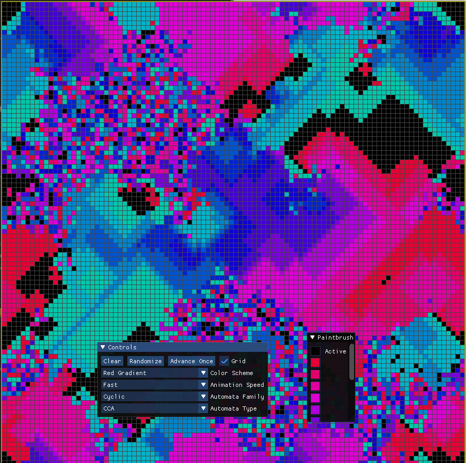

# Tomato Automata

A cellular automata simulation using SDL2 and Dear Imgui.

## About

The idea behind this project was to create a single application that can simulate many different [cellular automata](https://en.wikipedia.org/wiki/Cellular_automaton) rule sets. There are currently 8 categories of cellular automata implemented, with about 190 unique rule sets in total.

Tomato Automata allows you to test your own designs by manually setting the cell values via a paintbrush tool, or to completely randomize the grid and observe the effect it has for each rule set.

The rule set definitions were found here: http://www.mirekw.com/ca/ca_rules.html

## Getting Started

In order to compile and run this project, you will need:
- [GCC](https://gcc.gnu.org/)
- [GNU Make](https://www.gnu.org/software/make/)
- [SDL2](https://www.libsdl.org/)
- [OpenGL](https://www.opengl.org/)

Once you have installed all of the above, you should be able to clone this repo and run the `run.sh` script (or just `make`, then run the executable).

## Todo

- Implement more rule sets
- Implement zooming/panning on grid
- Implement brush sizing (allow to paint/erase in larger circles at once)
- Implement ability to use different rule sets for variations of Langton's Ant
- Take rule set definitions out of app.cpp and put them in a better spot (possibly load from a text file?)
- Fix issue with UI becoming unresponsive:
    - could adjust speed so that fps stays above 60 and UI becomes responsive (prefer this for now)
    - could draw on a different thread so that main thread stays responsive
    - definitely look into optimizing render and update algorithms so speed can stay up
